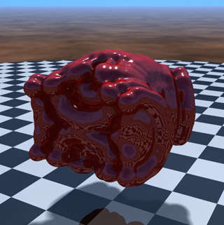

# MaterialMakerRayMarching

A library with Ray Marching nodes for Material Maker

## Install

1. Download MaterialMaker from https://rodzilla.itch.io/material-maker
2. Install MaterialMaker
3. Download the latest "MaterialMakerPauloFalcaoLib - v0.??.json" file, and save the file wherever you like
5. Run MaterialMaker
6. Click "Manage Libraries" -> "Load Library" -> Choose the saved json file

That's it! :)

## Examples

### Material Maker Experiment 001

* ShaderToy - https://www.shadertoy.com/view/fdsXWX
* MaterialMaker Selection File - [pxf001.mms ](Examples/pxf001.mms)
  * Just copy paste the code and the graph will appear, or save the file and use "Edit"->"Load Selection"
