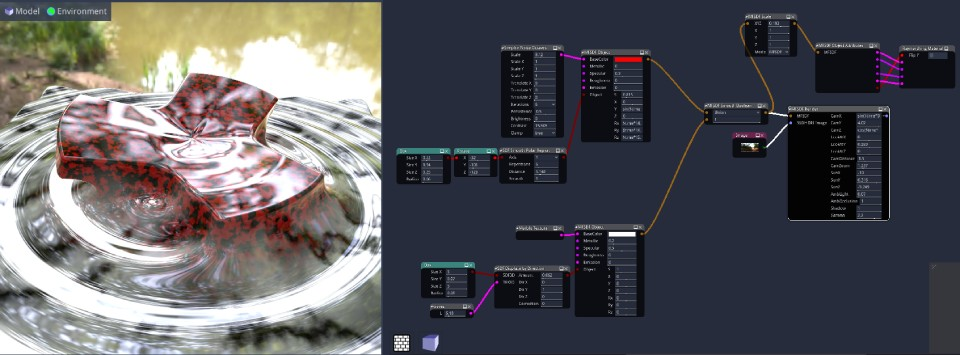

# MaterialMakerRayMarching

This is a library with Ray Marching nodes for Material Maker.

Make complex Ray Marching SDF objects using nodes with the Material Maker editor and this library

## Install

1. Download MaterialMaker from https://rodzilla.itch.io/material-maker
2. Install MaterialMaker
3. Download [MM_PauloFalcao_RayMarchingLib_v0_04.json](https://raw.githubusercontent.com/paulofalcao/MaterialMakerRayMarching/main/MM_PauloFalcao_RayMarchingLib_v0_04.json) file, and save the file wherever you like
5. Run MaterialMaker
6. Click "Manage Libraries" -> "Load Library" -> Choose the saved json file

That's it! :)

Here you can find a 1 hour seminar using version 0.04
 * https://www.youtube.com/watch?v=EKTZ593LS4A

Here you can find a 2 hours seminar using version 0.03
 * https://www.youtube.com/watch?v=PvmIohbf93Q

Here are some more videos playing with it
* https://www.youtube.com/watch?v=xnCdJ1hLLPk
* https://www.youtube.com/watch?v=27V8FOGmohQ
* https://www.youtube.com/watch?v=-1x-dFD695g
* https://www.youtube.com/watch?v=jxojcXgRkbM

Subscribe my YouTube channel https://www.youtube.com/channel/UCgU3v3BDnrs2C7SQyf-kzGg for videos about Material Maker and this library

And follow my twitter https://twitter.com/paulofalcao for news about this library

## Examples

Just copy paste the mms code and the graph will appear, or save the file and use "Edit"->"Load Selection"

### Soft Dip

* Shadertoy - https://www.shadertoy.com/view/mdXXWM
* MaterialMaker File - https://www.materialmaker.org/material?id=577
* YouTube playing - https://www.youtube.com/watch?v=uBpX1CG28c4

### Material Maker Experiment 007

* YouTube making - https://youtu.be/xnCdJ1hLLPk?t=461
* MaterialMaker Selection File - [pxf007.mms ](Examples/pxf007.mms)

### Material Maker Experiment 006

* YouTube making - https://youtu.be/xnCdJ1hLLPk?t=353
* MaterialMaker Selection File - [pxf006.mms ](Examples/pxf006.mms)

### Material Maker Experiment 005

* YouTube making - https://youtu.be/xnCdJ1hLLPk?t=288
* MaterialMaker Selection File - [pxf005.mms ](Examples/pxf005.mms)

### Material Maker Experiment 004

* YouTube making - https://youtu.be/xnCdJ1hLLPk?t=140
* MaterialMaker Selection File - [pxf004.mms ](Examples/pxf004.mms)

### Material Maker Experiment 003

* YouTube making - https://www.youtube.com/watch?v=VzV9zOzzUVA
* ShaderToy - https://www.shadertoy.com/view/NdSSRy
* MaterialMaker Selection File - [pxf003.mms ](Examples/pxf003.mms)

### Material Maker Experiment 002

* YouTube making - https://www.youtube.com/watch?v=VzV9zOzzUVA
* ShaderToy - https://www.shadertoy.com/view/NsBXzG
* MaterialMaker Selection File - [pxf002.mms ](Examples/pxf002.mms)

### Material Maker Experiment 001

* ShaderToy - https://www.shadertoy.com/view/fdsXWX
* MaterialMaker Selection File - [pxf001.mms ](Examples/pxf001.mms)

